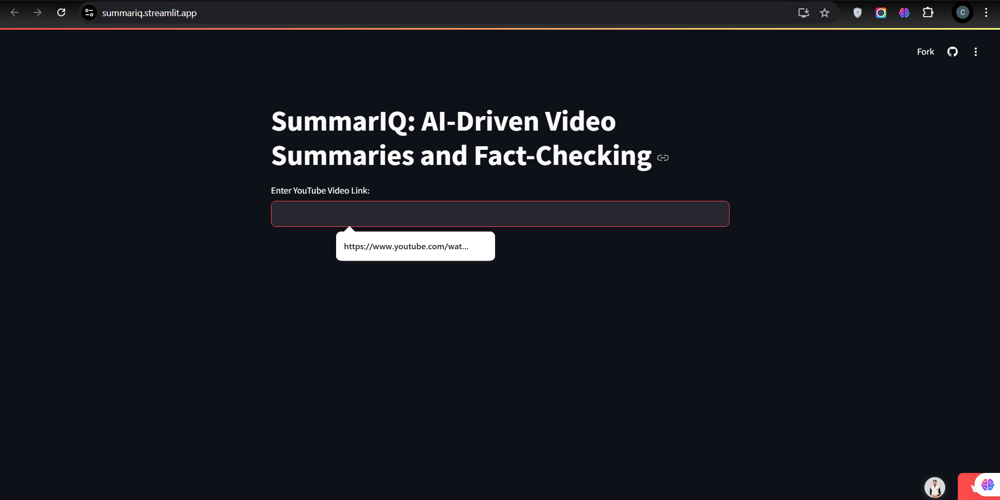

# SummarIQ - AI-Driven Video Summaries and Fact-Checking

**SummarIQ** is a Python-based application that leverages advanced AI models like Google’s Gemini Pro to automatically generate concise, high-quality summaries of YouTube videos. Built with Streamlit, it offers a user-friendly interface where users can input video links and instantly access detailed, insightful summaries. The tool simplifies content consumption, providing quick and actionable insights from video material in a highly efficient manner.

## Features

### Key Features of **SummarIQ**:

1. **AI-Powered Summarization**: Generates concise and structured summaries using Google Gemini Pro.  
2. **Fact-Checking Insights**: Provides actionable and reliable summaries to enhance understanding.  
3. **Streamlined User Interface**: Simple and intuitive platform powered by Streamlit for seamless interaction.  
4. **Customizable Prompts**: Tailored prompts guide the AI for domain-specific summarization.  
5. **Visual Feedback**: Displays video thumbnails and real-time status updates for user confirmation.  
6. **Error-Resilient Design**: Handles invalid inputs or unavailable content gracefully with clear feedback.  
7. **Future-Ready Features**: Scalable and extensible design for multilingual and advanced functionality.  

## Screenshot

## Getting Started

To run the application locally, follow these steps:

1. Clone this repository to your local machine.
2. Install the required Python dependencies listed in `requirements.txt` using `pip install -r requirements.txt`.
3. Set up your Google API key by creating a `.env` file in the root directory and adding your key:
4. Run the Streamlit app by executing the command `streamlit run app.py` in your terminal.
5. Access the Streamlit app in your web browser at `http://localhost:8501`.

## Dependencies

- `youtube_transcript_api`: Library for fetching transcripts from YouTube videos.
- `streamlit`: Framework for building interactive web applications with Python.
- `google_generativeai`: Library for accessing Google's Gemini Pro GenerativeAI.
- `python_dotenv`: Library for loading environment variables from `.env` files.
- `pathlib`: Library for handling file paths in an object-oriented way.

## Contributing

Contributions are welcome! Feel free to open an issue or submit a pull request with any improvements or bug fixes.

## License

This project is licensed under the [MIT License](LICENSE).
